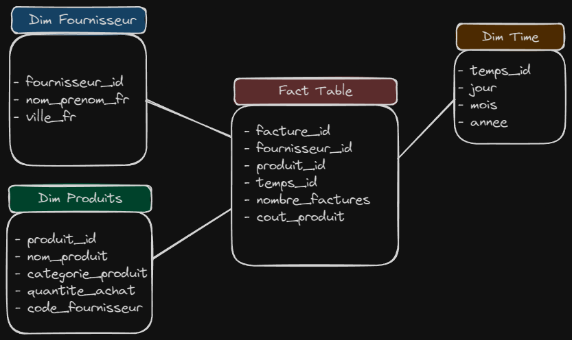

# Commerce Data Warehouse Building and Analysis

## Project Overview

This project involves the creation of a **Data Warehouse (DW)** to support a decision-making system for analyzing the management of products in a commerce setting. The process integrates data from multiple sources into a unified warehouse using the **ETL (Extract, Transform, Load)** process, implemented in Python. The data is then analyzed and visualized using **Power BI** for actionable insights.

---

## Database Schema

This is the Schema Data WareHouse :



---

## Objective

The main objective is to enable the analysis of key indicators such as:

- The number of supplier invoices by year (based on product purchase date).
- The cost of a product, calculated as:  
  **Cost of Product = Montant_Produit * Qt_Produit**

---

## Input Data

The project integrates data from the following files:
1. **fournisseur.csv**: Contains supplier information.
2. **produits.xls**: Details of products.
3. **cout_produit.csv**: Product costs.
4. **Fournisseur_facture.csv**: Supplier invoice data.

---

## ETL Process

The ETL process involves three stages:

### 1. **Extract**
Data is extracted from the input files mentioned above using **pandas**.

### 2. **Transform**
Data cleaning, normalization, and transformation are performed to align with the data warehouse schema:
- Creation of dimension tables:
  - `dim_fournisseur` (Supplier Dimension)
  - `dim_produit` (Product Dimension)
  - `dim_temps` (Time Dimension)
- Creation of the fact table:
  - `fact_ventes` (Sales Fact Table)

### 3. **Load**
The transformed data is loaded into a **MySQL database** using **SQLAlchemy**. 

---

## Python Libraries Used

- **pandas**: Data manipulation and transformation.
- **SQLAlchemy**: Database connection and data loading.

---

## Steps to Execute

1. **Setup MySQL Database**  
   Ensure MySQL is installed and running. Create a database named `bi_data_warehouse`.

2. **Install Required Libraries**  
   Use `pip` to install the required Python libraries:
   ```bash
   pip install pandas sqlalchemy 
   ```

3. **Run the ETL Script**  
   Execute the Python script to perform the ETL process and load the data into the database.

4. **Verify Database Content**  
   Check the MySQL database to ensure all tables (`dim_fournisseur`, `dim_produit`, `dim_temps`, `fact_ventes`) are populated with the expected data.

---

## Reporting with Power BI

The data loaded into the MySQL database is analyzed and visualized using **Power BI**. Key reports include:
- Annual supplier invoice counts.
- Product cost analysis by year and supplier.
- Time-based trends in product purchases.

---

## Results

The project successfully integrates diverse data sources into a unified data warehouse, enabling efficient reporting and decision-making for product management. The visual insights generated in Power BI empower stakeholders to monitor and optimize key performance indicators effectively.

---

Feel free to reach out for any questions or enhancements!